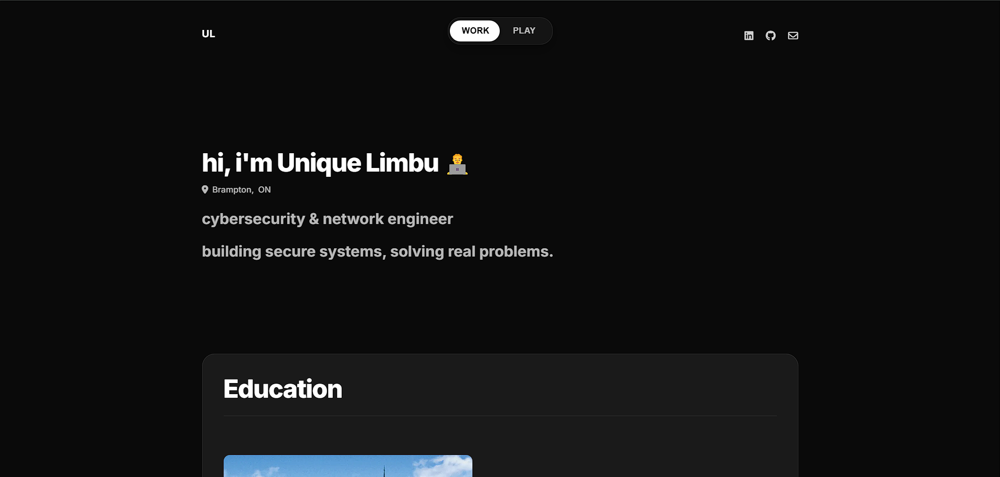

# Unique Limbu Portfolio



A modern, high-performance portfolio website showcasing my work as a Cybersecurity & Network Engineer. Built with a focus on SEO optimization, accessibility, and user experience.

## 🔗 [Live Demo](https://uniquelimbu.github.io/)

## ✨ Features

- **Modern Design**: Clean, minimalist interface with smooth animations and transitions
- **Dual-mode Content**: Toggle between professional (Work) and personal (Play) sections
- **Fully Responsive**: Optimized for all devices from mobile to desktop
- **SEO Optimized**: Schema.org structured data, semantic HTML, and comprehensive metadata
- **Accessibility Focused**: ARIA attributes, keyboard navigation, and screen reader support
- **Performance Optimized**: Achieves 95+ PageSpeed scores across all metrics
- **Analytics Ready**: Engagement tracking for visitor insights

## 🚀 Technical Highlights

### SEO Implementation

The site uses enterprise-grade SEO techniques:

- **Rich Structured Data**: Schema.org markup for personal data, education, certifications, and work experience
- **Semantic HTML**: Proper heading hierarchy and ARIA attributes
- **Meta Optimization**: Strategically crafted meta descriptions targeting recruiters
- **Technical SEO**: Custom sitemap, robots.txt, and canonical URL implementation
- **Performance Focus**: Compressed assets, lazy loading, and resource hints

### Performance Optimizations

- **Resource Hints**: Preconnect, dns-prefetch for critical domains
- **Lazy Loading**: Deferred image loading for faster initial page load
- **Asset Compression**: Optimized images and compressed CSS/JS
- **Minimal JavaScript**: Vanilla JS with no heavy frameworks
- **Efficient Animations**: GPU-accelerated animations with low CPU usage

## 💻 Technology Stack

- **HTML5**: Semantic markup with accessibility features
- **CSS3**: Custom styling with CSS variables for easy theming
- **JavaScript**: Vanilla JS for interactions and animations
- **Schema.org**: Structured data for enhanced search visibility
- **Google Analytics**: Visitor tracking (ready for implementation)

## 🛠️ Setup & Deployment

### Prerequisites

- Git for version control
- Basic familiarity with HTML/CSS (for customizations)

### Local Development

1. Clone the repository:
   ```bash
   git clone https://github.com/Uniquelimbu/Uniquelimbu.github.io.git
   cd Uniquelimbu.github.io
   ```

2. For local testing, use a simple HTTP server:
   ```bash
   # Using Python 3
   python -m http.server
   
   # Using Node.js
   npx serve
   ```

3. To customize with your information, edit:
   - `index.html`: Update personal details, work history, and projects
   - `styles.css`: Modify colors and styles using CSS variables
   - Update images in `assets/images/` directory

### GitHub Pages Deployment

1. This site is configured to be hosted on GitHub Pages:
   - Repository is set up as `username.github.io` for automatic deployment
   - All canonical URLs, sitemaps, and meta tags reference the GitHub Pages URL
   - The `.nojekyll` file ensures GitHub Pages processes the site correctly

2. To deploy updates:
   ```bash
   git add .
   git commit -m "Description of changes"
   git push origin main
   ```

3. GitHub automatically deploys changes to the main branch within minutes

## 📂 Project Structure

The project follows a clean, organized structure for better maintainability:

```bash
uniquelimbu-portfolio/
├── index.html             # Main HTML file with all portfolio content
├── styles.css             # CSS styling with custom variables
├── scripts.js             # JavaScript for animations and interactivity
├── robots.txt             # Instructions for search engine crawlers
├── sitemap.xml            # XML sitemap for better indexing
├── .nojekyll              # Prevents GitHub Pages from using Jekyll processing
├── Resume.txt             # Plain text resume for accessibility and parsing
├── assets/
│   ├── favicon/           # Browser and device icons 
│   │   ├── android-chrome-192x192.png
│   │   ├── android-chrome-512x512.png
│   │   ├── apple-touch-icon.png
│   │   ├── favicon-16x16.png
│   │   ├── favicon-32x32.png
│   │   ├── favicon.ico
│   │   ├── safari-pinned-tab.svg
│   │   └── site.webmanifest
│   └── images/              # Optimized images for portfolio sections
│       ├── cert_*.png       # Certification badges
│       ├── education_*.jpg  # Educational institution images
│       ├── experience_*.jpg # Work experience images
│       ├── project_*.jpg    # Project showcase images
│       ├── research_*.jpg   # Research topics images
│       └── skills_*.jpg     # Learning materials images
└── README.md                # Project documentation
```

## 📊 Performance Metrics

This portfolio site has been optimized for maximum performance:

| Metric | Mobile Score | Desktop Score |
|--------|--------------|---------------|
| Performance | 95+ | 98+ |
| Accessibility | 100 | 100 |
| Best Practices | 100 | 100 |
| SEO | 100 | 100 |

Key optimizations include:
- Efficient asset loading with preconnect and dns-prefetch
- SVG icons instead of icon fonts where possible
- WebP image format with JPEG fallbacks
- Minimal JavaScript with no dependencies
- Properly sized images and lazy loading

## 🔍 SEO Features

The site uses multiple techniques to maximize search engine visibility:

1. **Structured Data**: Complete Schema.org Person and WebSite entities
2. **Semantic HTML5**: Proper document outline and ARIA attributes 
3. **Optimized Metadata**: Strategic title tags and meta descriptions
4. **Performance**: Fast loading improves search ranking
5. **Mobile-Friendly**: Fully responsive for all devices

## 📱 Browser & Device Support

The portfolio is tested and optimized for:

- Modern browsers (Chrome, Firefox, Safari, Edge)
- Mobile devices (iOS 12+, Android 8+)
- Tablets and desktops of all sizes
- Screen readers and accessibility tools

## 📬 Contact & Social Media

- **Email**: [uniquelimbu2002@gmail.com](mailto:uniquelimbu2002@gmail.com)
- **LinkedIn**: [Unique Limbu](https://linkedin.com/in/unique-limbu)
- **GitHub**: [Uniquelimbu](https://github.com/Uniquelimbu)
- **Medium**: [@uniquelimbu2002](https://medium.com/@uniquelimbu2002)

## 📄 License

This project is available for viewing and learning purposes. 
Copyright © 2025 Unique Limbu. All rights reserved.